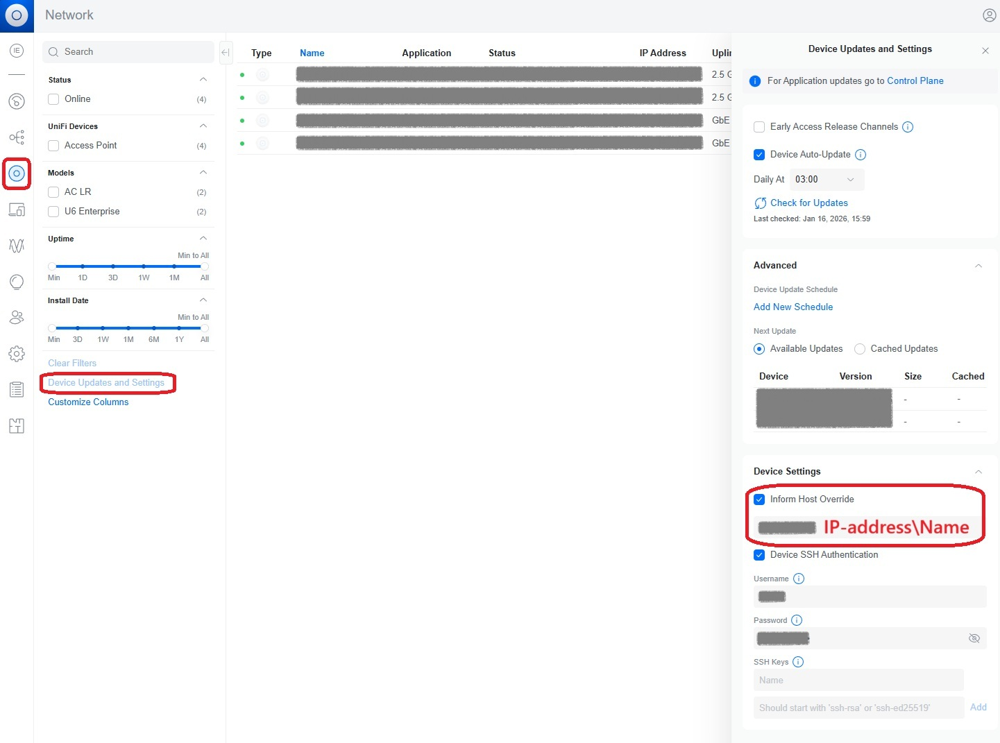

# UniFi Network Application with Docker Compose

## License and attribution

This project is based on the work  
docker-unifi-network-application  
https://github.com/linuxserver/docker-unifi-network-application

Original work  
Copyright © LinuxServer.io team

Modifications  
Copyright © 2026 Kuznetsov Evgenii

This project is distributed under the GNU General Public License v3.

## Overview

I needed to deploy a **UniFi Network Application** server and wanted to run it in a containerized setup.

The official UniFi images provide only the application container. MongoDB is expected to be external, and there is no official Docker Compose example that combines both components in a clean and production friendly way.

This repository contains a **Docker Compose setup** that brings everything together in a simple and reproducible manner.

---

## What is included

- `docker-compose.yml`
  - UniFi Network Application container
  - External MongoDB container
  - Healthchecks
  - Persistent volumes
- `init-mongo.sh`
  - MongoDB initialization script
  - Creates a dedicated database user for UniFi
  - Safe to re-run

---

## Prerequisites

- Linux host
- Docker Engine
- Docker Compose v2
- Open required UniFi ports on the host

---

## Directory layout

```text
/opt/unifi
├── docker-compose.yml
└── init-mongo.sh
```

---

## Required ports

The following ports must be open on the host machine for UniFi Network Application to function correctly.

| Port  | Protocol | Purpose                                           |
|------ |----------|---------------------------------------------------|
| 8443  | TCP      | UniFi Web UI and API access                       |
| 8080  | TCP      | Device inform and management                      |
| 3478  | UDP      | STUN, used by devices to discover the controller  |
| 10001 | UDP      | Layer 2 device discovery                          |

These ports are exposed in `docker-compose.yml` as follows:

```yaml
ports:
  - 8443:8443
  - 8080:8080
  - 3478:3478/udp
  - 10001:10001/udp
```

Make sure that firewalls on the host and upstream network devices allow incoming connections on these ports.

---

## Installation

### 1. Prepare directory

Create a working directory and copy the files:

```bash
sudo mkdir -p /opt/unifi
sudo cp docker-compose.yml /opt/unifi/
sudo cp init-mongo.sh /opt/unifi/
```

---

### 2. Configure MongoDB password

Edit `docker-compose.yml` and set your own MongoDB password:

```yaml
MONGO_INITDB_ROOT_PASSWORD=your_password_here
MONGO_PASS=your_password_here
```

All other settings can be left unchanged.

---

### 3. Make init script executable

```bash
sudo chmod +x /opt/unifi/init-mongo.sh
```

No changes inside `init-mongo.sh` are required.

---

### 4. Start the stack

```bash
cd /opt/unifi
docker compose up -d
```

---

## UniFi Inform Host configuration

After the initial startup and after restoring configuration from a backup or completing a fresh setup, it is required to explicitly set the IP address of the **host machine** where these containers are running.
In our case, UniFi devices did not connect to the controller until the Inform Host was manually configured. This may be a specific behavior of running UniFi Network Application in a containerized environment.
It is also strongly recommended that the UniFi controller host and Ubiquiti devices are located in the same network segment to allow proper device discovery. This limitation may be adjustable via additional UniFi settings, but it has not been investigated yet.




## Useful commands

### View logs

```bash
docker compose logs -f
```

---

### Stop containers

```bash
docker compose stop
```

---

### Start containers again

```bash
docker compose start
```

---

### Remove containers and images

```bash
docker compose down --rmi
```

---

## Notes

- MongoDB is intentionally external to the UniFi container, as recommended by UniFi.
- All data is stored in persistent volumes.
- Container restarts are safe.
- Suitable for home labs and small to medium installations.


---

## Disclaimer

Use it at your own discretion and always test before deploying to production.
